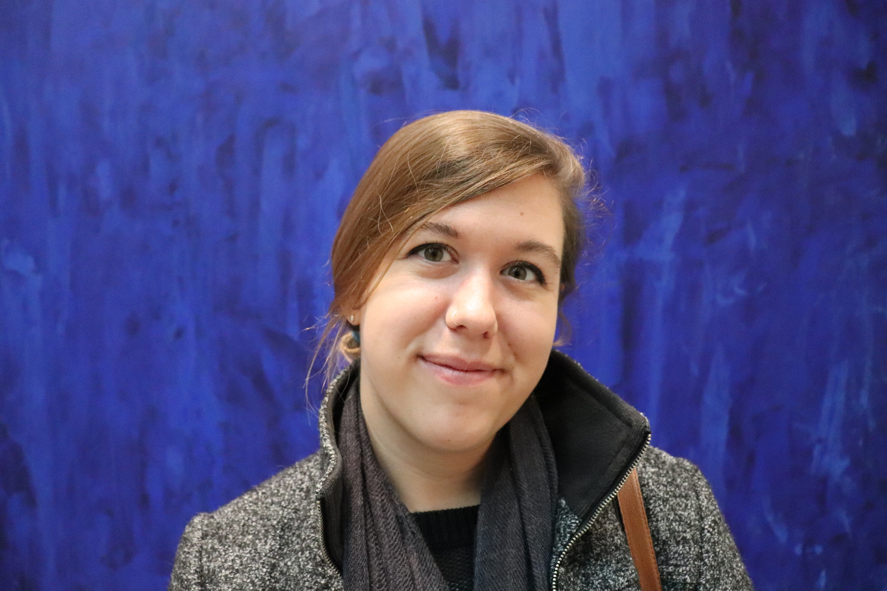

#Elizabeth (Beth) Blackwood

[**Home**](http://elizabethblackwood.cikeys.com/home)
[**CV**](http://elizabethblackwood.cikeys.com/cv) 
[**Workshops**](http://elizabethblackwood.cikeys.com/workshops)

    

  
Beth Blackwood is the Digital Curation and Scholarship Librarian at California State University, Channel Islands' [John Spoor Broome Library](https://library.csuci.edu/). Before joining CI, she spent several years in Washington, D.C. managing digital collections, infrastructure, and change at museums and cultural institutions. She has expertise with digital asset management systems and strategy, digital preservation, research data management, and is passionate about the creative commons.

**Contact:** elizabeth [dot] blackwood [at] csuci [dot] edu

