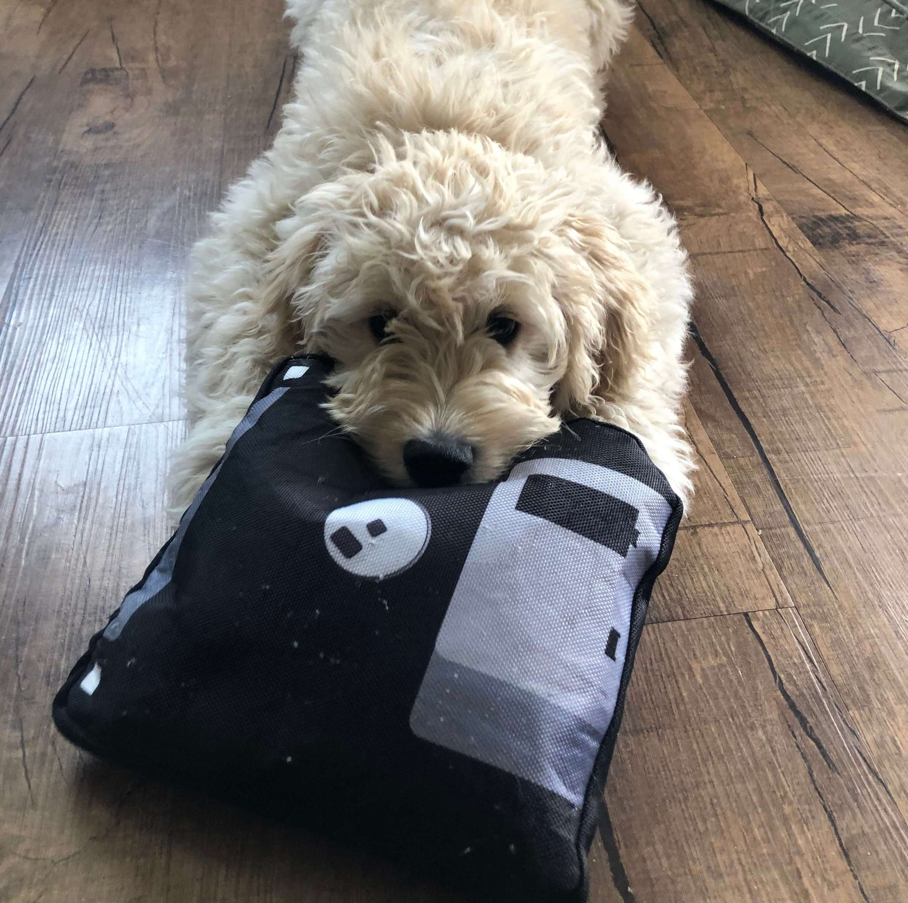

#Elizabeth (Beth) Blackwood

[**Home**](/)
[**CV**](http://elizabethblackwood.cikeys.com/cv) [**Workshops**](/workshops)

##Workshop Documentation, Data, & Slides 

Above: Beth's doodle demonstrating the importance of personal digital stewardship.
  
Links and information found on this page relate to workshops and events happening at CSU Channel Islands. Feel free to explore and use the content. Material is licensed through the Creative Commons unless otherwise stated. 
### Data Cleaning
[Data](https://www.kaggle.com/stefanoleone992/rotten-tomatoes-movies-and-critic-reviews-dataset) | [Slides](https://docs.google.com/presentation/d/1g_F3TFiU6epmHggd_rPX0PtcrTm6Z5oPhVX6KeQxA94/edit?usp=sharing)

### Digital Stewardship Best Practices
[Documentation](DigSteward-BP.html) 
 
### Intro to Research Data Management 
[Data](SwensonSchaffer-WSV1.zip) | [Documentation](RDM-Capstones.html) 

